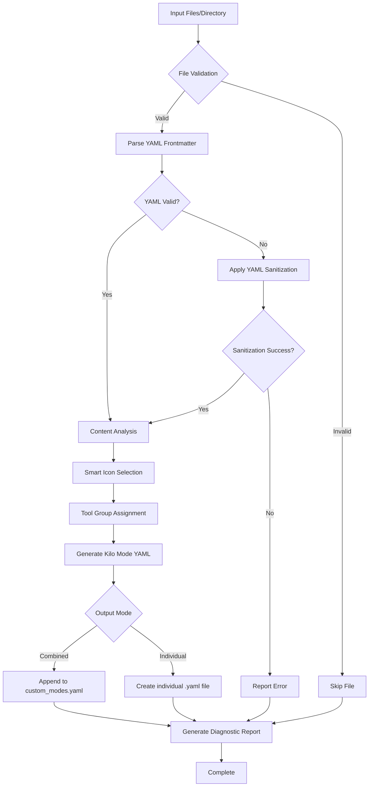
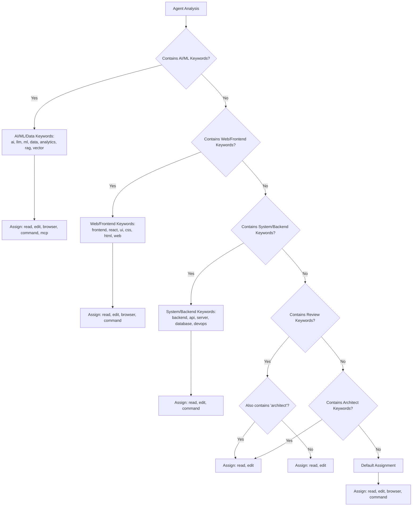
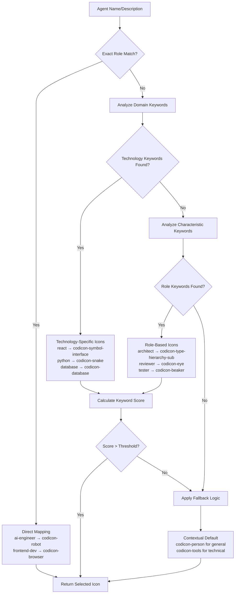
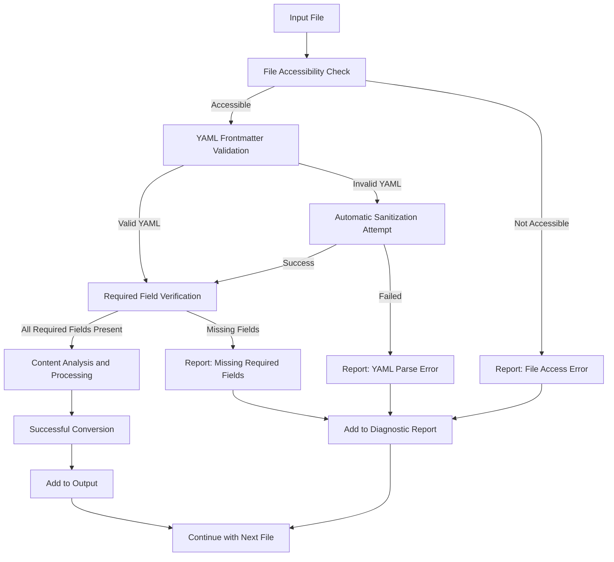
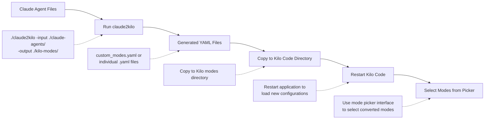
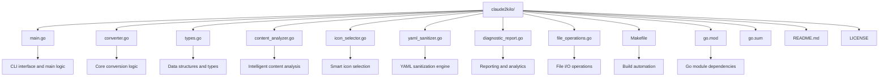

# claude2kilo

**Claude Agent to Kilo Code Mode Converter**

A sophisticated cross-platform tool for converting Claude Code sub-agent files to Kilo Code mode configurations with intelligent analysis, automatic sanitization, and comprehensive reporting.

## Overview

This Go application converts Claude Code sub-agent markdown files (with YAML frontmatter) into Kilo Code mode YAML configurations. The converter features intelligent content analysis, automatic icon selection, YAML sanitization, diagnostic reporting, and flexible output options.

## Key Features

### 🚀 **Core Conversion**
- **Cross-platform**: Single binary works on Windows, macOS, and Linux
- **Batch conversion**: Convert entire directories of sub-agent files
- **Flexible output**: Combined YAML file or individual mode files
- **Dry run mode**: Preview conversions without creating files
- **Folder structure preservation**: Maintains directory hierarchy in output

### 🧠 **Intelligent Analysis**
- **Smart icon selection**: Automatically chooses appropriate VS Code icons based on agent characteristics
- **Content analysis**: Generates intelligent "when to use" descriptions
- **Tool group mapping**: Automatically assigns appropriate tool groups based on agent type
- **Description generation**: Creates concise descriptions for mode cards

### 🔧 **Advanced Processing**
- **YAML sanitization**: Automatically fixes common YAML frontmatter issues
- **File validation**: Validates YAML frontmatter and required fields
- **Error handling**: Comprehensive error reporting with suggestions
- **Line ending support**: Handles both Unix and Windows line endings

### 📊 **Reporting & Diagnostics**
- **Diagnostic reports**: Detailed markdown reports of conversion results
- **Issue tracking**: Identifies and categorizes conversion problems
- **Statistics**: Comprehensive conversion metrics and success rates
- **Sanitization tracking**: Reports on automatically fixed files

## Installation

### Download Pre-built Binary

Download the appropriate binary for your platform from the releases page:

- **Windows**: `claude2kilo.exe`
- **macOS**: `claude2kilo-darwin`
- **Linux**: `claude2kilo-linux`

### Build from Source

This project uses a [`Makefile`](Makefile) for building cross-platform binaries. Ensure you have `make` and `Go 1.21+` installed.

#### Build Commands

```bash
# Clean previous builds
make clean

# Build for all platforms
make

# Build for specific platforms
make build-windows    # Windows
make build-macos      # macOS
make build-linux      # Linux

# List generated binaries
make list
```

## Usage

### Basic Usage

```bash
# Convert a single file
./claude2kilo -input ai-engineer.md -output ./kilo-modes/

# Convert all files in current directory to combined YAML
./claude2kilo -input . -output ./kilo-modes/

# Convert all files to individual YAML files
./claude2kilo -input ./claude-agents/ -output ./kilo-modes/ -single-files

# Convert files from another directory
./claude2kilo -input ./claude-agents/ -output ./kilo-modes/
```

### Command Line Options

| Option | Description | Default |
|--------|-------------|---------|
| `-input` | Input file (.md) or directory containing Claude Code sub-agent files | **(required)** |
| `-output` | Output directory for Kilo Code mode files | `./kilo-modes` |
| `-single-files` | Output each mode to individual YAML files instead of combined file | `false` |
| `-dry-run` | Show what would be converted without creating files | `false` |
| `-help` | Show help message | `false` |

### Advanced Examples

```bash
# Dry run to preview conversions
./claude2kilo -input ./agents/ -dry-run

# Convert with individual files and custom output
./claude2kilo -input ./claude-agents/ -output ./my-modes/ -single-files

# Convert single file with preserved structure
./claude2kilo -input ./specialized/python-pro.md -output ./kilo-modes/
```

## Conversion Process

The claude2kilo converter follows a sophisticated pipeline to transform Claude agent files into Kilo Code modes:



## Format Conversion

### Input: Claude Code Sub-agent Format

```markdown
---
name: ai-engineer
description: Build LLM applications, RAG systems, and prompt pipelines with advanced AI engineering expertise
model: opus
tools: [Read, Write, Bash, Browser]
---

You are an AI engineer specializing in LLM applications, RAG systems, and prompt engineering...
```

### Output: Kilo Code Mode Format

**Combined File** (`custom_modes.yaml`):
```yaml
customModes:
  - slug: ai-engineer
    name: Ai Engineer
    iconName: codicon-robot
    roleDefinition: Build LLM applications, RAG systems, and prompt pipelines with advanced AI engineering expertise
    whenToUse: Use this mode when you need AI/ML development, LLM integration, or machine learning workflows. Specialized in AI/ML development, LLM integration, data analysis, or machine learning workflows.
    description: AI and ML
    groups: [read, edit, browser, command, mcp]
    customInstructions: >-
      You are an AI engineer specializing in LLM applications, RAG systems, and prompt engineering...
    source: project
```

**Individual File** (`ai-engineer.yaml`):
```yaml
customModes:
  - slug: ai-engineer
    name: Ai Engineer
    iconName: codicon-robot
    roleDefinition: Build LLM applications, RAG systems, and prompt pipelines with advanced AI engineering expertise
    whenToUse: Use this mode when you need AI/ML development, LLM integration, or machine learning workflows.
    description: AI and ML
    groups: [read, edit, browser, command, mcp]
    customInstructions: >-
      You are an AI engineer specializing in LLM applications...
    source: project
```

## Intelligent Features

### 🎯 **Smart Tool Group Assignment**

The converter automatically assigns tool groups based on agent characteristics:

| Agent Type | Groups | Description |
|------------|--------|-------------|
| **AI/ML Engineers** | `[read, edit, browser, command, mcp]` | Full access including MCP for complex AI workflows |
| **Web/Frontend** | `[read, edit, browser, command]` | Browser access for testing UI components |
| **System/Backend** | `[read, edit, command]` | Command line tools for system operations |
| **Code Reviewers** | `[read, edit]` | Read-only analysis with editing for feedback |
| **Architects** | `[read, edit]` | Limited to documentation and design files |
| **Default** | `[read, edit, browser, command]` | Standard development tools |

#### Assignment Logic



**Keyword Categories:**
- **AI/ML/Data**: Keywords like "ai", "llm", "ml", "data", "analytics", "rag", "vector"
- **Web/Frontend**: Keywords like "frontend", "react", "ui", "css", "html", "web"
- **System/Backend**: Keywords like "backend", "api", "server", "database", "devops"
- **Review Only**: Keywords like "review", "reviewer", "audit" (without "architect")
- **Architect**: Keywords like "architect" combined with "review"

### 🎨 **Intelligent Icon Selection**

The converter uses a sophisticated scoring system to select appropriate VS Code icons:



**Selection Criteria:**
- **Exact role matching**: Direct mapping for common roles (e.g., "ai-engineer" → `codicon-robot`)
- **Domain keywords**: Technology-specific icons (e.g., "react" → `codicon-symbol-interface`)
- **Characteristic keywords**: Role-based icons (e.g., "architect" → `codicon-type-hierarchy-sub`)
- **Fallback logic**: Contextual defaults based on content analysis

### 📝 **Content Analysis**

Generates intelligent "when to use" statements by analyzing:

- **Role patterns**: Identifies primary use cases from agent descriptions
- **Domain specialization**: Detects technology domains and specializations
- **Action patterns**: Recognizes common development activities
- **Existing statements**: Extracts and reformats existing "Use PROACTIVELY for..." statements

## YAML Sanitization

The converter automatically fixes common YAML frontmatter issues:

### Automatic Fixes

- **Long descriptions with quotes** → Converted to YAML literal blocks
- **Tools as comma-separated strings** → Converted to YAML arrays
- **Embedded examples and special characters** → Properly formatted
- **Line ending normalization** → Handles Windows/Unix differences

### Example Sanitization

**Before** (problematic):
```yaml
description: An agent that helps with "complex tasks" and provides <example>code snippets</example>
tools: Read, Write, Bash, Browser
```

**After** (sanitized):
```yaml
description: |
  An agent that helps with "complex tasks" and provides
  
  <example>code snippets</example>
tools: [Read, Write, Bash, Browser]
```

## Diagnostic Reporting

### Comprehensive Reports

After each conversion, the tool generates detailed diagnostic reports:

- **Conversion statistics**: Success rates, failure counts, sanitization metrics
- **Issue categorization**: Groups problems by type with specific suggestions
- **File-specific details**: Individual file issues with resolution guidance
- **Best practices**: Guidelines for creating better Claude agent files

### Report Location

Reports are saved as `conversion-diagnostic-report.md` in the input directory.

### Sample Report Sections

```markdown
## Summary
- **Total files processed**: 47
- **Successfully converted**: 45 (95.7%)
- **Failed conversions**: 2 (4.3%)
- **Files requiring sanitization**: 12 (25.5%)

## Issues Found
### YAML Parsing Errors (2 files)
**File**: `problematic-agent.md`
**Issue**: missing required 'name' field
**Suggestion**: Add name field to YAML frontmatter
```

## Output Structure

### Combined Mode (Default)

```
kilo-modes/
└── custom_modes.yaml
```

### Individual Files Mode (`-single-files`)

```
kilo-modes/
├── ai-engineer.yaml
├── python-pro.yaml
├── frontend/
│   ├── react-specialist.yaml
│   └── ui-designer.yaml
└── backend/
    ├── api-developer.yaml
    └── database-admin.yaml
```

## Error Handling & Troubleshooting

### Common Issues

| Error | Cause | Solution |
|-------|-------|----------|
| `no valid YAML frontmatter found` | Missing `---` delimiters | Add proper YAML frontmatter |
| `missing required 'name' field` | No name in frontmatter | Add `name:` field |
| `missing required 'description' field` | No description in frontmatter | Add `description:` field |
| `YAML parsing failed` | Malformed YAML syntax | Check quotes, indentation, special characters |

### Validation Process



**Validation Steps:**
1. **File accessibility check**
2. **YAML frontmatter validation**
3. **Required field verification**
4. **Automatic sanitization attempt**
5. **Content analysis and processing**

### Getting Help

- Use `-dry-run` to preview conversions and identify issues
- Check the diagnostic report for detailed problem analysis
- Ensure YAML frontmatter follows proper syntax
- Verify all required fields are present

## Integration with Kilo Code

### Installation Steps



**Step-by-Step Process:**

1. **Convert your agents**:
   ```bash
   ./claude2kilo -input ./claude-agents/ -output ./kilo-modes/
   ```

2. **Copy generated files** to your Kilo Code modes directory

3. **Restart Kilo Code** to load the new modes

4. **Select modes** from the mode picker interface

### File Compatibility

- Generated YAML files are fully compatible with Kilo Code
- Follows standard Kilo Code mode configuration format
- Includes all required fields and proper formatting
- Supports both individual and combined mode files

## Development

### Project Structure



### Dependencies

- **Go 1.21+**: Modern Go version with latest features
- **gopkg.in/yaml.v3**: YAML parsing and generation
- **Standard library**: File operations, regex, string processing

### Building

The project uses Go modules and includes a comprehensive Makefile for cross-platform builds.

## Contributing

We welcome contributions! Please see our [Contributing Guidelines](.github/CONTRIBUTING.md) for details.

### Development Setup

1. **Clone the repository**
2. **Install Go 1.21+**
3. **Run tests**: `go test ./...`
4. **Build locally**: `make`

### Reporting Issues

Please use our [issue templates](.github/ISSUE_TEMPLATE/) for:
- 🐛 Bug reports
- ✨ Feature requests
- 📝 Documentation improvements

## License

This project is licensed under the MIT License - see the [LICENSE](LICENSE) file for details.

## Support

- **Issues**: Create an issue in the repository
- **Discussions**: Use GitHub Discussions for questions
- **Documentation**: Check this README and diagnostic reports
- **Examples**: Provide sample files when reporting conversion problems

---

**Made with ❤️ for the Claude and Kilo Code communities**
